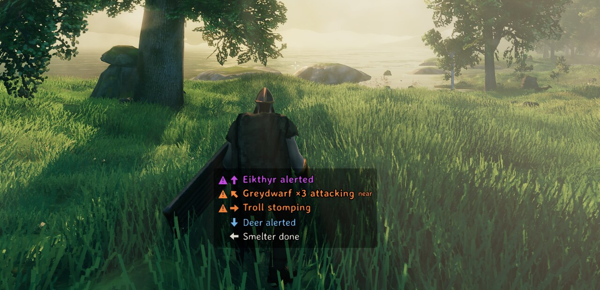

# Earshot

Closed captions for the Valheim sounds worth reacting to. A Greydwarf spotting you, a Troll
stomping through the trees, a Boar charging at you, your smelter finishing: each gets a short
caption at the bottom of the screen, with an arrow pointing where it came from. Made for deaf and
hard-of-hearing players, and for anyone playing with the sound low.

*Sample captions from `earshot demo` in the Meadows: a boss, three Greydwarfs close by, a Troll to
the right, a Deer behind, a smelter to the left.*

## Features

- **Captions with direction.** Every line has an arrow pointing at the sound relative to where
  you're looking, and it turns as you turn. Close threats get a `near` tag; distant sounds are
  dimmer.
- **Built not to flood the screen.** Five Greydwarfs are one line, `Greydwarf ×5 attacking`. When
  the list is full, bosses and raids push out enemies, enemies push out wildlife, and wildlife
  pushes out everyday world sounds. Idle chatter is throttled. Sounds you can already see up close
  are dimmed.
- **Only what you'd want to react to.** Your own actions stay silent: footsteps, swings, chopping,
  and any chest or door you open — anything within the game's 5 m interaction range. Captions come
  from the game's own sound data (Valheim ships an unfinished caption system that Earshot brings
  to life), fixed and extended where it's wrong or missing.
- **Works with sound off.** Audibility is measured at your position from the sound itself, not
  from your volume settings. The default cutoff is 0.05, low enough to catch most of a sound's
  range.
- **Settles in after a portal or login.** World sounds are ignored for a few seconds after you
  arrive through a portal or log in, so a door doesn't caption itself replaying its opening sound
  as the area loads.
- **Readable for everyone.** Each category has its own colour, chosen to stay distinct with
  colour blindness, and threats are also bold with a warning mark, so colour is never the only cue.
- **Your language.** Creature and building names use the game's own translations. Earshot's few
  words can be translated with a text file (see Translating).

## Turning it on and off

Captions are on as soon as the mod is installed. **Settings → Accessibility → "Closed captions
(Earshot)"** turns them off and on. Everything else lives in the BepInEx configuration manager
(F1).

## Configuration

| Section | Setting | Default | Meaning |
| --- | --- | --- | --- |
| General | Enabled | `true` | Master switch. The same switch as 'Closed captions' in Settings > Accessibility. |
| General | MinimumVolume | `0.05` | How loud a sound must be where you stand to get a caption (0 to 1). 0.05 covers most of a sound's range. Ignores your volume sliders, so captions work with sound off. |
| Categories | Boss | `true` | Bosses: their alerts, attacks and summons. |
| Categories | Raid | `true` | A raid starting and running near you. |
| Categories | Enemy | `true` | Hostile creatures: alerted, attacking, footsteps. |
| Categories | Wildlife | `true` | Idle creature sounds, throttled so chatter doesn't flood the list. |
| Categories | World | `true` | Things that need attention: a smelter finishing, food done or burning, doors you didn't open, a shield generator low on fuel. |
| Categories | Ambient | `false` | Constant background: fires, torches, distant thunder. |
| Display | MaxLines | `5` | Caption lines shown at once. |
| Display | Linger | `3` | Seconds a line stays after its sound was last heard. |
| Display | IdleCooldown | `20` | Seconds before the same creature's idle chatter can start a new line. |
| Display | OffsetX | `0` | Horizontal nudge from bottom centre, in HUD pixels (positive is right). |
| Display | OffsetY | `0` | Vertical nudge in HUD pixels (positive is up). |
| Display | Scale | `1` | Size of the caption list. |
| Display | BackgroundOpacity | `0.6` | Opacity of the dark plate behind the captions. |
| Display | DimOnScreen | `true` | Dim lines whose source is close and on screen, and rank them lowest within their category. |
| Display | SnapArrows | `true` | Arrows point in 8 directions. Off: they rotate smoothly. |
| Display | NearDistance | `10` | Metres within which threats get the 'near' tag. |
| Colors | Boss | `#E056FF` | Caption colour for Boss. |
| Colors | Raid | `#FFD84A` | Caption colour for Raid. |
| Colors | Enemy | `#FF8A3D` | Caption colour for Enemy. |
| Colors | Wildlife | `#7EC8FF` | Caption colour for Wildlife. |
| Colors | World | `#E8E4DA` | Caption colour for World. |
| Colors | Ambient | `#B5B0A6` | Caption colour for Ambient. |
| Debug | LogUnlabelled | `false` | Log each audible sound that got no caption, once, so gaps can be reported. |
| Debug | Verbose | `false` | Log every caption decision. Noisy. |

## Console

- `earshot` — what's on screen right now, plus the last 20 sounds heard and why each did or
  didn't get a caption.
- `earshot unlabelled` (also `unlabeled`) — every audible sound this session that had no caption.
- `earshot demo` — sample captions for 20 seconds, for screenshots and for previewing colour and
  size settings.

## Reporting a missing caption

Turn on Debug → LogUnlabelled (F1), play for a bit, then run `earshot unlabelled` in the console
and include its output in your report:
https://github.com/jumpingmushroom/Earshot/issues

## Translating

Copy `src/Earshot/translations/English.txt` from this repository to
`BepInEx/config/Earshot/translations/<Language>.txt`, using the game's own name for the language
(`German.txt`, `Norwegian.txt`, ...), and translate the right-hand side of each line. Missing lines
fall back to English. Pull requests with translations are welcome.

## Compatibility

Client-side, safe to add or remove at any time, works on vanilla servers, needs nothing on the
server. Console players on crossplay servers aren't affected (and can't run mods).
